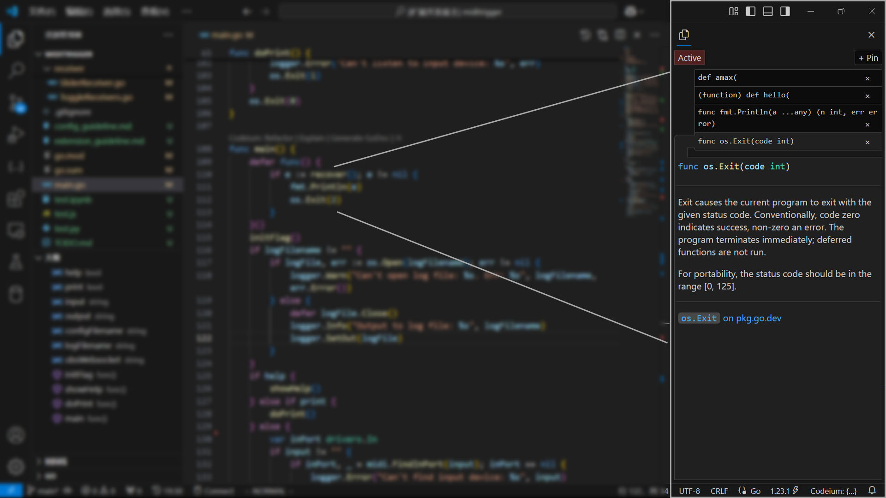

# Doc Panel

Dive in and let your code speak for itself.

[（中文）](#Chinese)

## Features

- **From Pointer to Cursor**. Replace *Pointer Hovering as Doc* with *Cursor Position as Doc*, reducing mouse movements and keeping your workflow uninterrupted, especially ideal for key-mappings like Vim!
- **Pin Your Docs, Own Your Flow**. Pin key docs and switch between real-time preview and pinned views, keeping your context anchored where you need it most.
- **Broad Language Support**. Fully tested on GoDoc, JsDoc, and PyDoc, and compatible with any programming language with a language server.

> Best Practices: Move the panel to the secondary side bar (on the right often), and pin your docs when you need them.

## Requirements

This extension requires some programming language extensions that support hover requests to get documentation for symbols under the pointer.

## Settings and Commands

This extension contributes the following settings:

* `docpanel.codeWrapping`: Wrap code blocks in the panel, set to `false` may cause the panel scrollable on X-asix, and the line arrangement will be kept.

And the following commands:

* `docpanel.refresh-active-doc`: Refresh the active document panel.

---

# Chinese

## 功能特性
- **键盘而非鼠标**。根据键盘光标位置直接获得文档，无需鼠标悬停，让编码顺畅无阻。尤其适合与 Vim 插件配合使用！（当然也可以独立使用）
- **固定并灵活切换文档**。固定重要文档，在实时预览与固定视图间无缝切换，随时参考。
- **广泛的语言支持**。已在 GoDoc、JsDoc 和 PyDoc 上全面测试，并且兼容任何有 Language Server 的编程语言。

> 最佳实践：将面板移动到辅助侧栏（通常在右侧），并在需要的时候固定你的文档。

## 使用要求
此插件需要与另一些支持鼠标悬停文档的编程语言插件配合使用（并将其鼠标悬停功能转化为由键盘光标位置触发），以获取对应符号的文档。如：Google的Go插件、微软的Python插件等。基本都是在 VSCode 中编写对应语言代码所必需的插件，因此并无额外的负担。

## 设置和命令
此插件提供以下设置项:

* `docpanel.codeWrapping`: 是否对代码块进行自动换行，设置为 `false` 可能会导致面板在 X 轴滚动，但可以保持行的原始观感。

以及以下命令：

* `docpanel.refresh-active-doc`: 手动刷新当前文档面板（并切换到实时模式）。

--- 

# Release Notes

### 1.0.0

Initial release of Doc Panel for Go

### 1.0.1

Covered more languages